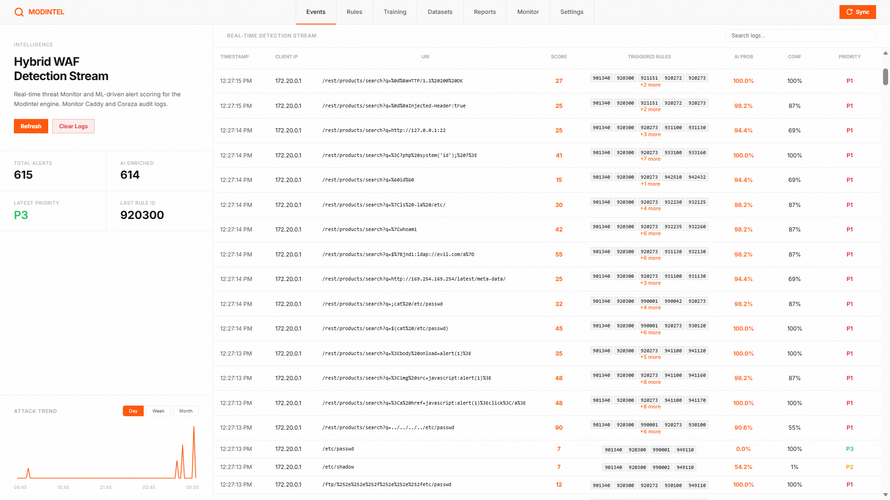

<div align="center">
  <h1> Modintel</h1>

  
  
  
  
  

  <br/>

<b>Modintel</b> is a hybrid Web Application Firewall (WAF) research system designed to reduce false positives in rule-based WAFs using Machine Learning. 

It functions as an intelligence layer that sits alongside the OWASP Core Rule Set (CRS) running on Coraza (The modern ModSecurity). 

  <br/>

  

</div>

## Architectural Philosophy

Rule-based systems are excellent at catching known attacks, but struggle with nuance, leading to high false-positive rates. Machine learning excels at nuance, but is dangerous if allowed to block traffic blindly without explicit rules.

ModIntel combines both:
**Rules detect (catch known attacks) → ML judges (handles nuance) → Humans verify (edge cases).**

## Core Architecture

Incoming traffic passes through a Caddy reverse proxy into the Coraza WAF engine. When Coraza flags a request based on the OWASP CRS, the extracted features are sent to a local ML inference engine. 

- High-confidence attacks are blocked instantly.
- Verified safe anomalies are allowed through.
- Edge cases are routed to a human-review dashboard. 
  - **Security Analysts** use the dashboard to triage alerts and verify false positives.
  - **Administrators** use the dashboard to manage users, monitor system health, and oversee model performance.
## Directory Structure

```text
modintel/
├── proxy-waf/                 # Caddy reverse proxy & Coraza WAF config
├── services/                  # Backend microservices (log-collector, inference-engine)
├── ml-pipeline/               # Python ML models, datasets, and notebooks
├── landing-site/              # Public marketing site (React/Vite)
├── dashboard/                 # Admin review dashboard for human triage
├── docs/                      # Extensive project documentation
├── script/                    # Commit hooks and automation scripts
├── docker-compose.yml         # Dev/Prod orchestration
```

## Technology Stack

- **Reverse Proxy**: Caddy
- **WAF Engine**: Coraza (OWASP CRS)
- **Log Ingestion & Edge APIs**: Go
- **ML Infrastructure**: Python (Random Forest/XGBoost exported to ONNX)
- **Database**: MongoDB
- **Dashboard**: HTML/CSS/JS

## Development Setup

### Prerequisites
- Node.js & npm
- Go
- Python 3.x
- Docker & Docker Compose

### Commit Hooks
This project uses [lefthook](https://github.com/evilmartians/lefthook) for commit validation.

To install hooks:
```bash
npm install
npx lefthook install
```

Hooks enforce:
- **Commit message format**: `type(scope): message` (e.g., `feat: add new feature`)
- **No comments in new code**: Added files must not contain comments

## License

This project is licensed under the MIT License.
