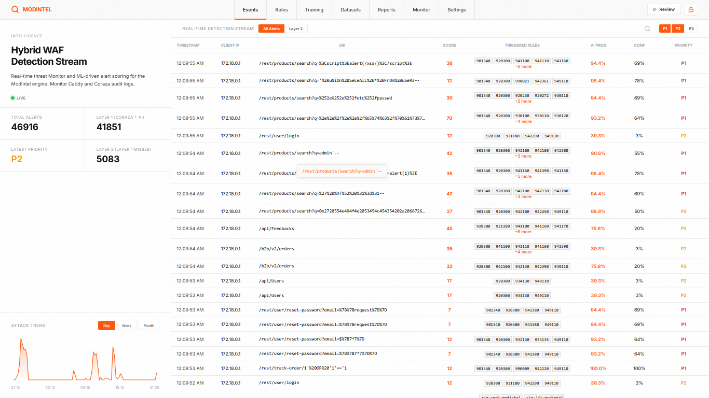

<div align="center">
  <h1> Modintel</h1>
  
  <div>
  
  
  
  
  
  </div>
  
  <br />

<b>Modintel</b> is a hybrid Web Application Firewall (WAF) research system designed to reduce false positives in rule-based WAFs using Machine Learning. 

It functions as an intelligence layer that sits alongside the OWASP Core Rule Set (CRS) running on Coraza. 

  <br/>

  

</div>

## Architectural Philosophy

Rule-based systems are excellent at catching known attacks, but struggle with nuance, leading to high false-positive rates. Machine learning excels at nuance, but is dangerous if allowed to block traffic blindly without explicit rules.

ModIntel combines both:
**Rules detect (catch known attacks) → ML judges (handles nuance) → Humans verify (edge cases).**


### Traffic Flow

1. Incoming requests hit Caddy (port 8080) then pass through Coraza WAF with OWASP CRS + 26 custom rules
2. **proxy-waf** blocks matching requests (403) and writes audit events to `audit.json`
3. **Caddy access log** records all requests (blocked + allowed) to its own log
4. **Log Collector** tails both logs:
   - Coraza audit log → parse triggered rules, anomaly score → upsert to MongoDB → send to **Inference Engine** for AI enrichment
   - Caddy access log → apply regex signatures (SQLi, XSS, CMDi) → if signature matches AND WAF didn't block → create miss-detection alert → send to Inference Engine `/predict-miss`
5. **Inference Engine** returns advisory prediction (attack probability, confidence, SHAP explanations, priority band P1/P2/P3)
6. **waf-blocker** enforces Layer-2 ML blocking threshold (configurable 85–100%) by rejecting requests via Docker iptables rules
7. **Review API** serves alerts, rules, stats, WAF management, datasets, and training endpoints to the **Dashboard**
8. **Auth Service** handles login, JWT tokens (15m access + 168h refresh with rotation), sessions, RBAC, and optional TOTP 2FA
9. **Health Aggregator** probes all services every 1s via HTTP/TCP and streams Docker events
10. **Metrics** aggregated every 60s into MongoDB (latency p50/p95/p99, goroutines, memory, MongoDB stats)


## Dashboard

A 17-page interface served statically via the review-api (Caddy reverse-proxies port 3000):

| Route | Purpose |
|-------|---------|
| `/signin` | JWT-based authentication |
| `/events` | Real-time alert dashboard with SSE stream |
| `/review` | Analyst review queue (label TP/FP, filter by priority/source) |
| `/rules` | WAF rule browser, toggle enable/disable, view overrides |
| `/monitor` | Real-time service health monitoring |
| `/training` | ML model training, activation, history |
| `/datasets` | Dataset management, balance, merge, export |
| `/reports` | Evaluation report viewer (v1/v2/v3) |
| `/settings` | Profile, sessions, user management, SMTP, 2FA |
| `/audit-logs` | Audit trail with filters, cursor pagination, CSV export |
| `/help` | Documentation |
| `/setup` | First-run admin setup wizard |
| `/setup-2fa` | TOTP 2FA enrollment |
| `/login-2fa` | 2FA verification during login |
| `/accept-invite` | User invitation acceptance |
| `/forgot-password` | Password reset request |
| `/reset-password` | Password reset with token |

## Directory Structure

```text
joab/
├── proxy-waf/                 # Caddy + Coraza WAF configuration
│   ├── Caddyfile              # Reverse proxy, routing
│   ├── coraza.conf            # Coraza WAF base config (SecRuleEngine On)
│   ├── custom_rules.conf      # 26 custom SecRules (LFI, CMDi, SQLi, XSS, SSRF, SSTI, NoSQLi, XXE, Log4Shell, CRLF)
│   └── overrides/             # Managed overrides (runtime rule enable/disable)
├── services/
│   ├── auth-service/          # Go (Gin) — JWT auth, RBAC, session management, 2FA
│   ├── review-api/            # Go (Gin) — Alert/rule/stats CRUD, SSE hub, audit logs, dataset API
│   ├── log-collector/         # Go — Coraza + Caddy log tailing, regex signatures, AI enrichment
│   ├── inference-engine/      # Python (FastAPI) — ML inference (predict, predict-miss, batch, SHAP, ONNX)
│   ├── training-api/          # Python (FastAPI) — Model training orchestration, dataset export
│   ├── waf-blocker/           # Go — Layer-2 ML blocking enforcement via Docker iptables
│   ├── health-aggregator/     # Go — HTTP/TCP probe health aggregation + Docker events
│   └── proxy-waf-custom/      # Custom Caddy Docker build (with mirror plugin)
├── ml-pipeline/               # Python — Training, evaluation, datasets
│   ├── feature_extractor.py   # WAFFeatureExtractor (sklearn transformer, 22+ features)
│   ├── train_model.py         # Multi-model training + calibration (RF, XGB, LGBM, LR)
│   ├── evaluate_model.py      # Evaluation report generator (HTML with per-family metrics)
│   ├── feature_schema.json    # Feature contract (v1.0.0, 4 groups)
│   └── tests/                 # pytest test suite
├── models/
│   ├── v1/                    # Logistic Regression
│   ├── v2/                    # Random Forest
│   └── v3/                    # Random Forest (current active, F1 98.9%)
├── dashboard/                 # 17-page static HTML/CSS/JS admin dashboard
├── data/                      # Raw + processed datasets (Parquet, JSONL)
├── scripts/                   # Attack testing suite + git hooks
├── docs/                      # SRS, SDS, AI plan, auth guide
├── .github/workflows/         # CI/CD pipelines (lint, test, e2e, docker, codeql)
├── docker-compose.yml         # 12-service orchestration
├── .env.example               # Environment variable template
├── invite.md                  # Feature plan (first-admin setup, TOTP 2FA, SMTP invites)
├── rules.md                   # WAF rules reference
└── todo.md                    # Task tracking
```

## Technology Stack

- **Reverse Proxy**: Caddy (with mirror plugin)
- **WAF Engine**: Coraza + OWASP CRS (Paranoia 4)
- **Backend Services**: Go (Gin framework, 6 services)
- **ML Inference**: Python (FastAPI, scikit-learn, SHAP, ONNX Runtime)
- **ML Training**: XGBoost, LightGBM, Random Forest, Logistic Regression, isotonic calibration
- **Database**: MongoDB 7 (replica set)
- **Dashboard**: 17-page static HTML/CSS/JS (served via review-api)
- **Orchestration**: Docker Compose (12 services)
- **SSE**: Real-time event streaming (alerts, stats, metrics, health)
- **Email**: Mailpit (test SMTP server)
- **Auth**: JWT (HS256), bcrypt, TOTP 2FA, sliding-window rate limiting

## CI/CD

GitHub Actions workflows on the `main` branch:

| Workflow | Description |
|----------|-------------|
| **Lint** | Go lint (golangci-lint), Python lint (ruff), YAML lint, format checks |
| **Test** | Go tests (race detector, Go 1.22/1.23/1.26), Python tests (pytest), build verification |
| **E2E** | Docker Compose build, start, health check, integration test |
| **Docker** | Docker image builds |
| **CodeQL** | Security analysis |
| **Link Check** | Documentation link validation |

## Development Setup

### Prerequisites
- Go 1.22+
- Python 3.11+
- Docker & Docker Compose
- Node.js & npm (for commit hooks)

### Quick Start

```bash
cp .env.example .env
docker compose up -d
```

The WAF proxy will be available at `http://localhost:8080` and the dashboard at `http://localhost:3000`.

### Attack Testing

Run the 47-payload attack suite against the WAF:

```powershell
.\scripts\attack_suite.ps1 -RunCount 1
```

## Roadmap

See [todo.md](todo.md):

## License

This project is licensed under the MIT License.
